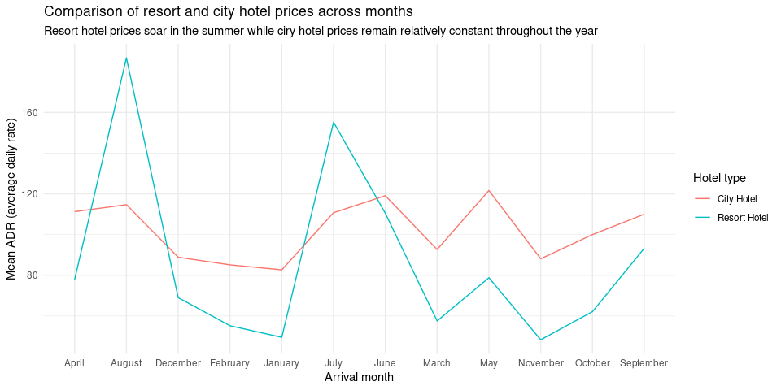

Hotel bookings - factors
================
Mine Çetinkaya-Rundel

``` r
library(tidyverse)
library(skimr)
```

``` r
# From TidyTuesday: https://github.com/rfordatascience/tidytuesday/blob/master/data/2020/2020-02-11/readme.md
hotels <- read_csv("https://raw.githubusercontent.com/rfordatascience/tidytuesday/master/data/2020/2020-02-11/hotels.csv")
```

First, knit the document and view the following visualisation. How are
the months ordered? What would be a better order? Then, reorder the
months on the x-axis (levels of `arrival_date_month`) in a way that
makes more sense. You will want to use a function from the **forcats**
package, see <https://forcats.tidyverse.org/reference/index.html> for
inspiration and help.

**Stretch goal:** If you finish the above task before time is up, change
the y-axis label so the values are shown with dollar signs, e.g. $80
instead of 80. You will want to use a function from the **scales**
package, see <https://scales.r-lib.org/reference/index.html> for
inspiration and help.

``` r
# set the right order
hotels %>%
  mutate(mark_factor = factor(arrival_date_month, 
                              levels = c("January", "February", "March", "April", "June",
                                         "july", "August", "September", "October", 
                                         "November", "December")))
```

    ## # A tibble: 119,390 x 33
    ##    hotel        is_canceled lead_time arrival_date_year arrival_date_month
    ##    <chr>              <dbl>     <dbl>             <dbl> <chr>             
    ##  1 Resort Hotel           0       342              2015 July              
    ##  2 Resort Hotel           0       737              2015 July              
    ##  3 Resort Hotel           0         7              2015 July              
    ##  4 Resort Hotel           0        13              2015 July              
    ##  5 Resort Hotel           0        14              2015 July              
    ##  6 Resort Hotel           0        14              2015 July              
    ##  7 Resort Hotel           0         0              2015 July              
    ##  8 Resort Hotel           0         9              2015 July              
    ##  9 Resort Hotel           1        85              2015 July              
    ## 10 Resort Hotel           1        75              2015 July              
    ## # … with 119,380 more rows, and 28 more variables:
    ## #   arrival_date_week_number <dbl>, arrival_date_day_of_month <dbl>,
    ## #   stays_in_weekend_nights <dbl>, stays_in_week_nights <dbl>, adults <dbl>,
    ## #   children <dbl>, babies <dbl>, meal <chr>, country <chr>,
    ## #   market_segment <chr>, distribution_channel <chr>, is_repeated_guest <dbl>,
    ## #   previous_cancellations <dbl>, previous_bookings_not_canceled <dbl>,
    ## #   reserved_room_type <chr>, assigned_room_type <chr>, booking_changes <dbl>,
    ## #   deposit_type <chr>, agent <chr>, company <chr>, days_in_waiting_list <dbl>,
    ## #   customer_type <chr>, adr <dbl>, required_car_parking_spaces <dbl>,
    ## #   total_of_special_requests <dbl>, reservation_status <chr>,
    ## #   reservation_status_date <date>, mark_factor <fct>

``` r
hotels %>%
  group_by(hotel, arrival_date_month) %>%   # group by hotel type and arrival month
  summarise(mean_adr = mean(adr)) %>%       # calculate mean adr for each group
  ggplot(aes(
    x = arrival_date_month,                 # x-axis = arrival_date_month (in alphabetical order due to factor status)
    y = mean_adr,                           # y-axis = mean_adr calculated above
    group = hotel,                          # group lines by hotel type
    color = hotel)                          # and color by hotel type
    ) +
  geom_line() +                             # use lines to represent data
  theme_minimal() +                         # use a minimal theme
  labs(x = "Arrival month",                 # customize labels
       y = "Mean ADR (average daily rate)",
       title = "Comparison of resort and city hotel prices across months",
       subtitle = "Resort hotel prices soar in the summer while ciry hotel prices remain relatively constant throughout the year",
       color = "Hotel type")
```

    ## `summarise()` has grouped output by 'hotel'. You can override using the `.groups` argument.

<!-- -->
