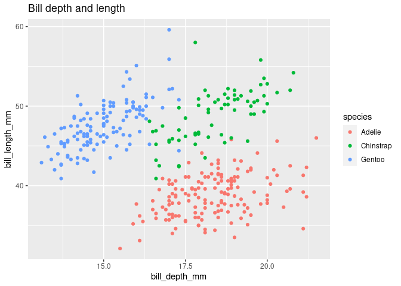

Visualizing Palmer Penguins (Exploratory Data Analysis)
================

# Palmer Penguins

### Scatterplot

``` r
ggplot(data = penguins, # gives a blank canvas
       mapping = aes(x = bill_depth_mm, # gives x variables (can be histogram)
                     y = bill_length_mm, # makes y relationship
                     colour = species)) + # specifies a color difference
  geom_point() + # plots points
  labs(title = "Bill depth and length") # adds a title
```

    ## Warning: Removed 2 rows containing missing values (geom_point).

<!-- -->
